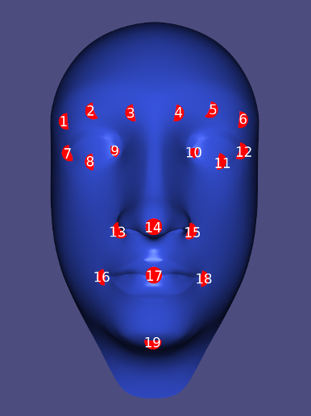

# Landmark selection

_FaceMasters-LandmarkSelection_ can be used to define landmarks on a template face mesh and scanned meshes, so that the former can be warped to match the latter. Selecting more landmarks than the ones specified by the landmark index shown below can help avoid unwanted warping of facial features with high detail (e.g. lips and eyes). However, it is recommended to instead place landmarks carefully and use low **Lambda** values during the first few warping steps to attain the best results with the provided landmarks. Landmarks are simply selected by clicking on the desired locations on the mesh. The program also saves an image of the mesh with the selected landmarks for reference.



**Note**: to build the program, the CMAKE option `-DLIBIGL_WITH_PNG=ON` needs to be specified

### Format of the `*.mark` files:

Each row has the format:
```
<index> <v1> <v2> <v3> <alpha> <beta> <gamma>
```

where:

```
<index> := the landmark index (see landmarks_index.png)
<v1>,...,<v3> := vertex index
<alpha>, <beta>, <gamma> := barycentric coordinates (i.e. landmarkPosition = alpha * v1 + beta * v2 + gamma * v3)
```
